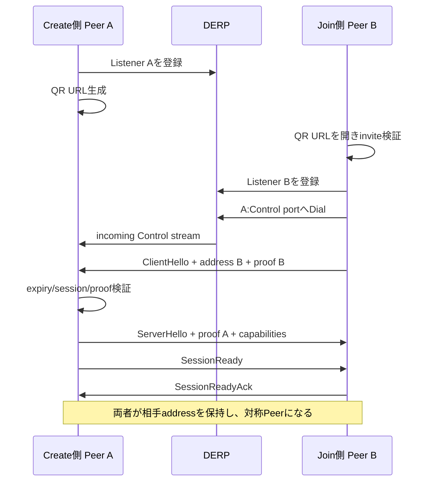

# 02. ユーザーフローとUI仕様

## 1. UI原則

- Native／Web、Host／Joinerという技術用語を通常画面へ出さない。
- ユーザーが意識する状態は「接続待ち」「接続中」「接続済み」「送信／受信」「切断」のみ。
- LocalSendのように、大きな送信アクション、明確な相手表示、簡潔な進捗を優先する。
- QRを主要操作にするが、リンクコピーを常に代替手段として提供する。
- 画面遷移より単一window内のstate transitionを優先する。

## 2. 起動モード

### 2.1 招待なし起動

対象:

- Native appを通常起動
- Cloudflare Web appのroot URLを開く

処理:

1. UIを`Initializing`で表示。
2. エフェメラルなTailcat Listenerを開始。
3. session IDとinvite secretを生成。
4. invite URLを作成。
5. QRコードと「リンクをコピー」を表示。
6. 接続を待つ。

### 2.2 招待あり起動

対象:

- `https://<host>/#i=<invitation>`を開く
- 将来のNative deep link

処理:

1. invitationをdecode・validate。
2. URL fragmentを`history.replaceState`等でアドレスバーから除去。
3. 自分のTailcat Listenerを開始。
4. invitationに含まれるHost addressへControl Streamを開く。
5. invitation proofと自分のListener addressを送信。
6. HostからAckを受ける。
7. `Connected`へ遷移。

## 3. Host／Joiner接続sequence



## 4. 状態機械

```text
Booting
  ├─ invitationなし → StartingListener → CreatingInvite → AwaitingPeer
  └─ invitationあり → ParsingInvite → StartingListener → DialingHost

AwaitingPeer / DialingHost
  → Authenticating
  → ConnectedIdle

ConnectedIdle
  ├─ OutgoingOffer → AwaitingAcceptance → Sending → ConnectedIdle
  ├─ IncomingOffer → AwaitingUserDecision → Receiving → ConnectedIdle
  ├─ PeerDisconnected → Disconnected
  └─ UserDisconnect → Disconnecting → Disconnected

すべての状態
  → RecoverableError または FatalError
```

### 状態遷移ルール

- 1つのsession generationに古いasync callbackを混入させない。generation IDで無効化する。
- `ConnectedIdle`以外では新規送信を開始できない。
- incoming offer受信中に別offerが来たら`Busy`を返す。
- `Sending`中にpeerからofferが来たらP0では`Busy`を返す。
- disconnectはidempotentにする。

## 5. 画面仕様

### 5.1 Boot／WASMロード

表示:

- アプリ名
- 「準備しています」
- WebのみTailcat WASMロード進捗
- Retry可能なエラー

WebではGo WASMが比較的大きいため、白画面のまま待たせず、HTML bootstrap shellでロード進捗を先に表示してよい。Slintの起動後に共通UIへ切り替える。

### 5.2 QR接続待ち

```text
┌──────────────────────────────┐
│ TailSend                     │
├──────────────────────────────┤
│                              │
│          [ QR ]              │
│                              │
│ 別の端末で読み取ってください  │
│                              │
│ 有効期限 09:43               │
│ [リンクをコピー] [再生成]     │
│                              │
│ 接続を待っています            │
└──────────────────────────────┘
```

要件:

- QRはスマートフォン標準カメラで読める余白とcontrastを確保。
- 長いURLでもQR versionが過大にならないようinvite encodingを最小化。
- countdownは表示用であり、実際の検証はmonotonic／UTC timestampで行う。
- expiry時に新規listenerを作り直すか、同一listenerで新secretを出すかは実装Phase 1で測定して決める。安全側の既定はlistenerごと再生成。

### 5.3 Join接続中

```text
┌──────────────────────────────┐
│ TailSend                     │
├──────────────────────────────┤
│                              │
│ 招待を確認しています          │
│ 相手に接続しています…         │
│                              │
│ [キャンセル]                  │
└──────────────────────────────┘
```

段階表示:

- 招待を確認中
- 安全な接続を準備中
- Relayへ接続中
- 相手を認証中

### 5.4 Connected Home

```text
┌──────────────────────────────┐
│ <Peer name> と接続中   [切断] │
├──────────────────────────────┤
│                              │
│ [ テキスト ] [ ファイル ]    │
│ [ フォルダー（将来） ]        │
│                              │
├──────────────────────────────┤
│ このセッション               │
│ ↑ report.pdf       完了       │
│ ↓ こんにちは       受信済み   │
└──────────────────────────────┘
```

- Host／Joiner表示は不要。
- Browser／Nativeはdiagnosticsでのみ表示可能。
- 相手名は`Hello`で受け取る。未設定時は`Chrome on Android`等の安全なfallback。
- P0のhistoryはsession memory内のみ。

### 5.5 テキスト送信Dialog

- multiline input
- UTF-8 byte length表示
- 1MiB上限
- 空文字は送信不可
- Send／Cancel

受信Dialog:

- 相手名
- 文字数／byte数
- 長文はpreviewと展開
- Accept／Reject

### 5.6 ファイル送信

- File picker呼び出し
- 選択一覧: name、size
- 合計件数／size
- Remove item
- Send／Cancel

### 5.7 受信Offer

- 相手名
- 件数／合計size
- 各file name／size
- 保存先またはdownload方法
- Accept／Reject

P0では部分承認をしない。

### 5.8 転送進捗

- direction
- current file
- file index／count
- transferred／total
- percentage
- smoothed throughput
- Cancel

推定残り時間は不安定ならP1へ回してよい。

## 6. Responsive layout

- 600 logical px未満: bottom action layout、single column。
- 600以上: centered card／two-columnを許容。
- touch targetは44px相当以上を目標。
- desktopではTab／Shift+Tab、Enter、Escapeを支援。
- QRは短辺に合わせ、最大360px程度。

## 7. Platform capability表示

共通UIはcapability flagを受け取る。

```text
can_pick_files
can_save_streaming
can_copy_invite
can_open_received_file
can_share_out
can_choose_directory
```

未対応機能は非表示またはdisabled＋理由表示。Web Safariで大容量streaming saveが未対応の場合、誤って「対応」と見せない。

## 8. エラー表現

ユーザー向け例:

- 招待リンクが無効です
- 招待の有効期限が切れています
- 相手が見つかりません
- この招待はすでに使用されています
- 相手が受信を拒否しました
- 保存先へ書き込めませんでした
- 接続が切れました

診断詳細:

- stable error code
- component (`invite`, `tailcat`, `protocol`, `filesystem`, `ui_bridge`)
- operation
- internal cause chain

秘密情報はdiagnosticsへ含めない。
